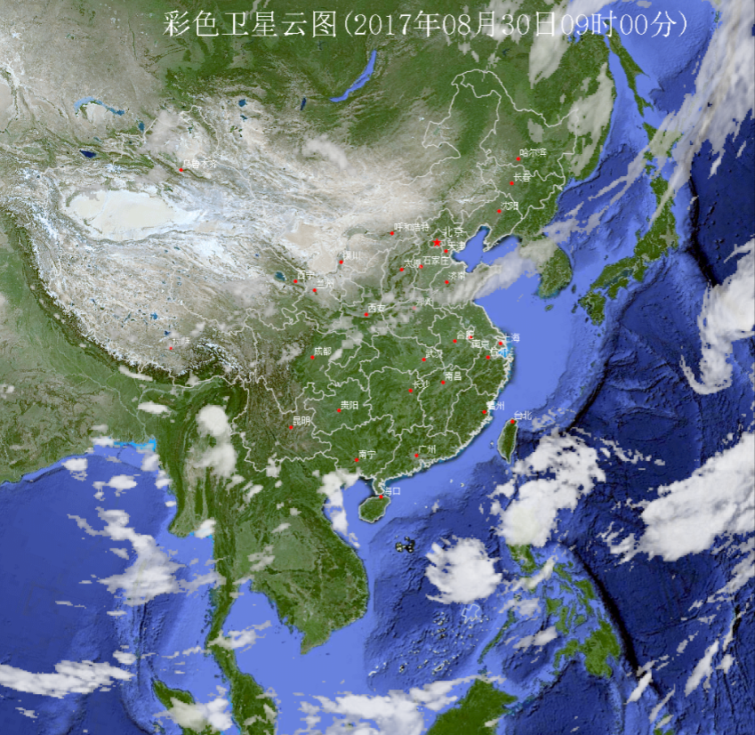
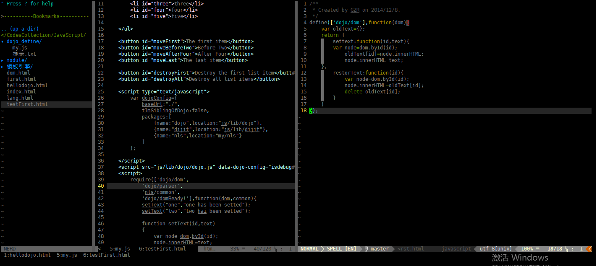
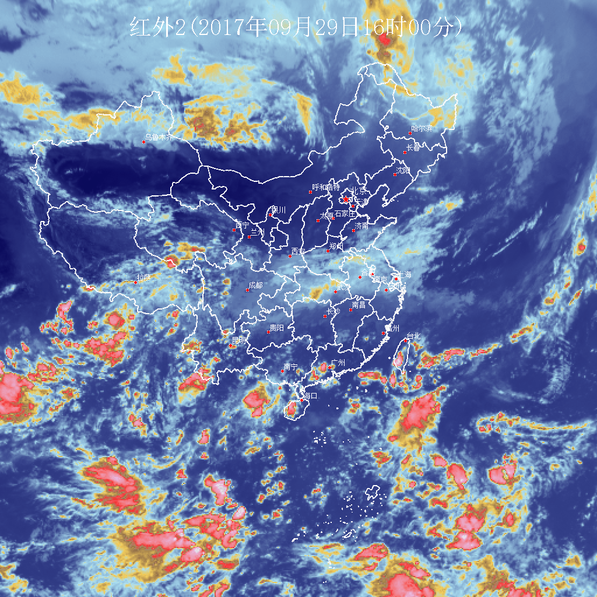
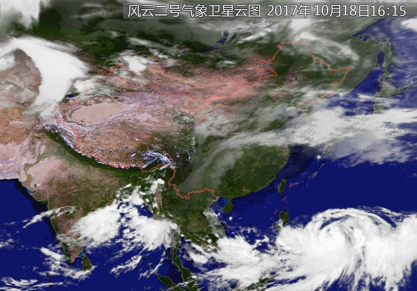
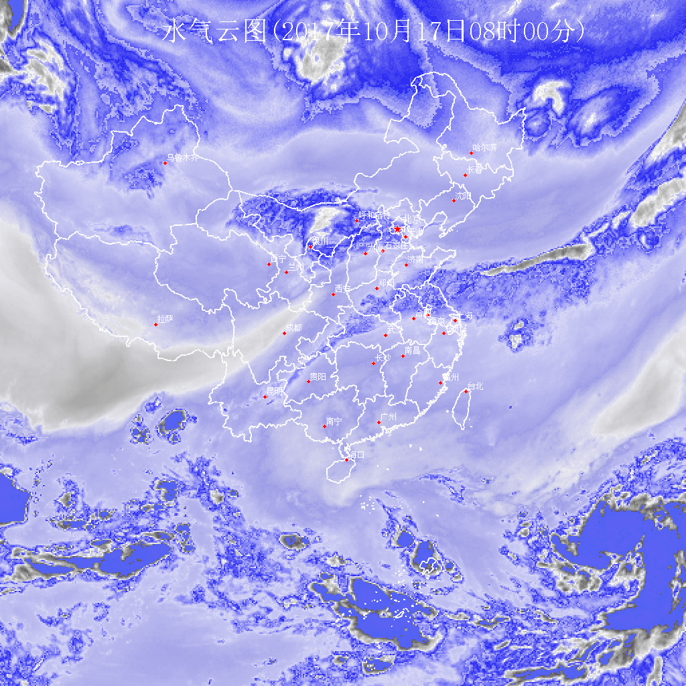
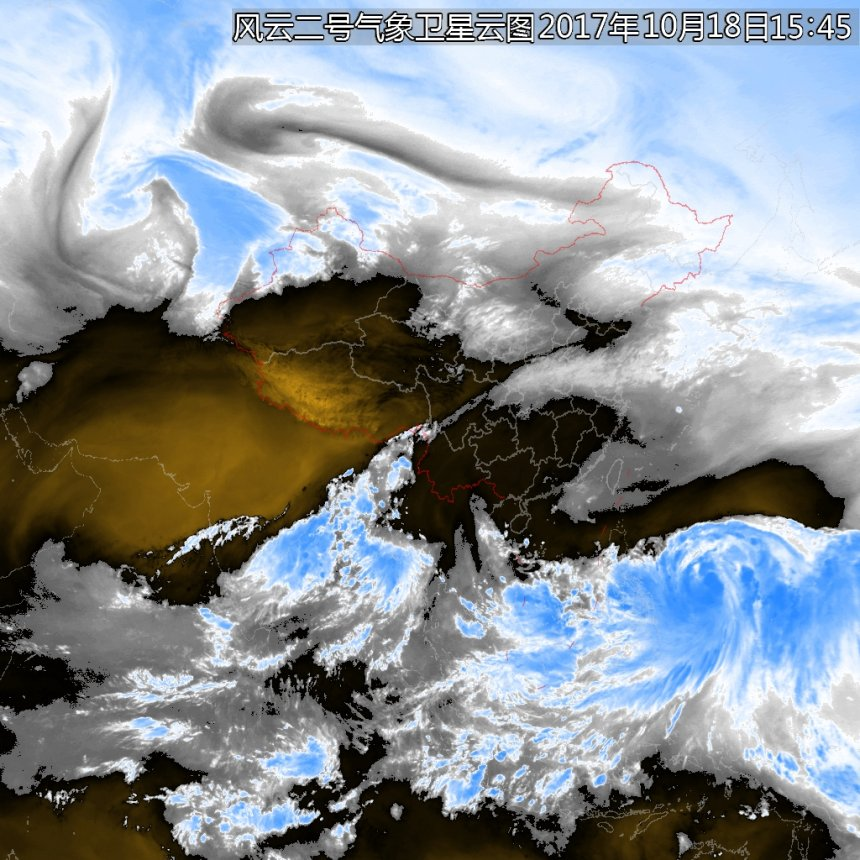
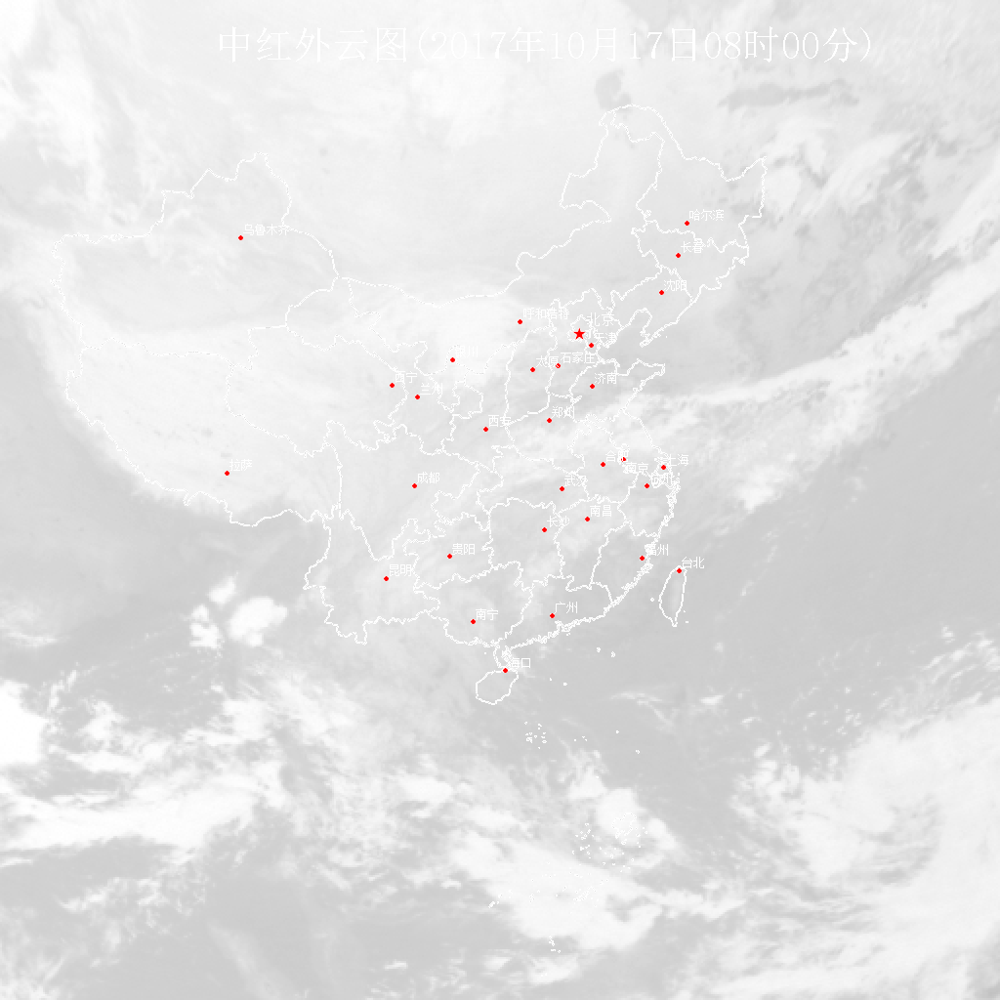

# 代码生成器-气象数据处理
> 直接上需求，有一份*.000的实时气象二进制数据和一份配色文件，要通过代码实现将二进制数据转化渲染为彩色卫星云图、分裂窗图像、水汽云图和中红外云图。二进制的气象数据处理已有别的工程师完成解析，也做好了如下图的彩色卫星云图效果，接下来要完成如[中央气象台](http://www.nmc.cn/publish/satellite/fy2evisible.html)网站上的可见光（分裂窗图像）、水汽云图(水汽云图)和红外云图(中红外云图)的效果。


<center>彩色卫星云图</center>


## 分析
拿到代码咨询朋友后，原来处理彩色卫星云图的色带是某个开发人员一个一个测试写出来的if-else判断，如下
```JS
if(value<184){
	color=new Color(0,0,0,0);
}
else if(value<191){
	color=new Color(value-16,valuevalue-16,value-16);
}
else if(value<194){
	color=new Color(value-13,valuevalue-13,value-13);
}
else if(value<196){
	color=new Color(182+(value-194)*2,(value-194)*2,182+(value-194)*2,(value-194)*2);
}
else if(value<198){
	color=new Color(185+(value-196)*2,(value-196)*2,185+(value-196)*2,(value-196)*2);
}
else if(value<200){
	color=new Color(188+(value-198)*2,(value-198)*2,188+(value-198)*2,(value-198)*2);
}
else if (value<204){
	color =new Color(191+(value-200)*2,(value-200)*2,191+(value-200)*2,(value-200)*2);
}
else if(value<207){
	color =new Color(value-6,value-6,valuvalue-6);
}
else if(value<210){
	color=new Color(202+(value-207)*2,(value-207)*2,202+(value-207)*2,(value-207)*2);
}
else if(value==210){
	color=new Color(207,207,207,207);
}
else if(value<214){
	color=new Color(value-2,value-2,valuvalue-2);
}
else if(value == 214){
	color=new Color(214,214,214,214);
}
else if(value<218){
	color = new Color(215+(value-215)*2,(value-215)*2,215+(value-215)*2,(value-215)*2);
}
else if(value<222){
	color=new Color(220+(value-218)*2,(value-218)*2,220+(value-218)*2,(value-218)*2);
}
else if(value<233){
	color=new Color(value+4,value+4,valuvalue+4);
}else {
	color=new Color(value-1,value-1,valuvalue-1);
}
```
看到这样的代码，我只能说真得很有想象力；但是这毕竟是气象产品，不能靠猜，或者自己写色带去渲染，这样不一定和标准的图像一致，如果要修改，岂不是每个都要变或者重新创建，更何况用在生产环境，在专业单位会影响别人某方面的判断的。经过询问原来有配色文件，要了一份过来，格式是.pal;文件夹的名称是micaps13；
文件内容大致是这样的。
```
March 102 云图调色板-18
           1     91      9      9
           2     91     10     10
           3     91     10     10
           4     91     10     10
           5     91     10     10
           ......
         250     83     80     83
         251     71     68     71
         252     59     56     59
         253     46     45     46
         254     34     33     34
         255     10     10     10
         256      0      0      0
```
还有一个.ini的说明文件，内容如下：
```

[兰勃托设置]

卫星X系数=3.23
卫星Y系数=3.24


雷达X系数=8.54
雷达Y系数=8.6

[麦卡托设置]
卫星X系数=1.5
卫星Y系数=1.46


[基本设置]
显示色标=false

[调色板]
红外=I-01.PAL
水汽=W-01.PAL
可见光=V-01.PAL
雷达反射率=R-37.Pal

;注意数据类型写在数据中，如果数据内容不正确，无法使用正确的调色板
[监视]
自动更新=True
更新时间=10
监视数值=10
监视显示=False

```
对此文件大致的猜测最多就是.pal文件这么理解：
```
March 102 云图调色板-18： 可能无关痛痒的文字说明
    V   R   G   B

    V:从二进制文件中读到的某个数字+1对应的值
    R: 红色
    G: 绿色
    B：蓝色
```
经各种途径搜索，在[MiFun](http://www.micaps.cn/MiFun/main)这个网站找到了相关气象的中国人民，抓住机会了解过后，我这个理解差不多对，但是从二进制到.pal文件的映射关系因渲染文件的不同而不同。就此作罢，只能靠无限的想象力了。
## Coding
因为已经有渲染文件了，那么接下来的事情就是将前面的那团糟糕的if-else替换成标准值即可，同样有中央气象台的数据作为结果参照，那接下来的问题就是用这份pal文件组合出一份可以渲染成和中央气象台发布的图像一致的图片就ok了，要生成这么多的if-else不合理，改用switch-case结构，可是代码量不会变，对于我这种懒人来说怎么可能一行一行的写呢，所以想到了以前学过的代码生成器，环境本机没有，正好自己有阿里云，上面Python环境自带，还有装逼利器VIM,

so,想法有了，撸起袖子就是干。结果如下；
```Python
#!/usr/local/bin/python
# code ..
from itertools import islice
import sys
#pal_name = 'W-01'
print("begin process.....")
for i in range(1,len(sys.argv)):
    pal_name = sys.argv[i]
    print("process " + pal_name)
    with open('../pal/'+pal_name+'.pal') as file:
        with open("../code_txt/"+pal_name+"_CODE.txt", 'w') as code_file:
            code_file.write("switch(value) {\n")
            for line in islice(file,1,None):
                row = line.split()
                temp = "case " + str(int(row[0])-1)+ ":\n" +"    " + "color = new Color("+ row[3]+", "+ row[2]+ ", " +row[1]+ ", 255"  +");\n" + "    break;\n"
                code_file.write(temp)
            code_file.write("default:\n    color = new Color(0, 0, 0, 255);\n break;")
            code_file.write("\n}")
    print('process '+ pal_name+' finished...')

```
在这里面用到了itertools的islice用来跳过第一行，提高执行效率，还用到了脚本参数sys.argv,当然存在bug，这个脚本只是在完美情况下运行的样子，但生成的代码是没有bug的。弄完之后将生成的代码copy到java代码中，看看中红外的运行情况：
生成的代码大致如下：
```java
switch(value) {
	case 0:
	    color = new Color(9, 9, 9, 255);
	    break;
	case 1:
	    color = new Color(50, 98, 243, 255);
	    break;
	case 2:
	    color = new Color(50, 98, 243, 255);
	    break;
	case 3:
	    color = new Color(50, 98, 243, 255);
	    break;
	// ......
	case 254:
		color = new Color(96, 98, 243, 255);
	    break;
	case 255:
		color = new Color(97, 98, 243, 255);
	    break;
	default:
	    color = new Color(98, 98, 243, 255);
	    break;
}

```

<center>代码生成器生成的效果</center>


<center>客户提供</center>

经过不断调试组合，终于完成了三种图的代码生成器；代码基本一致，就是调整了代码中row[number]的顺序。
## “剑归宗万”看效果


<center>彩色卫星云图</center>


<center>分裂窗图像</center>



<center>水汽图像</center>



<center>中红外图像</center>